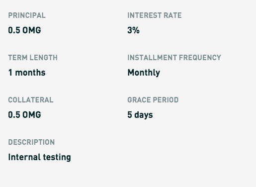

# pavel.paperbank.eth

## Where can I access this loan?

[https://plex.dharma.io/fill/loan?amortizationUnit=months&collateralAmount=500000000000000000&c](https://plex.dharma.io/fill/loan?amortizationUnit=months&collateralAmount=500000000000000000&c)

## Have you had a chance to answer the previous question?

Yes, after a few months we finally found the answer. Sadly, Mike is on vacations right now so I'm afraid we are not able to provide the answer at this point.

